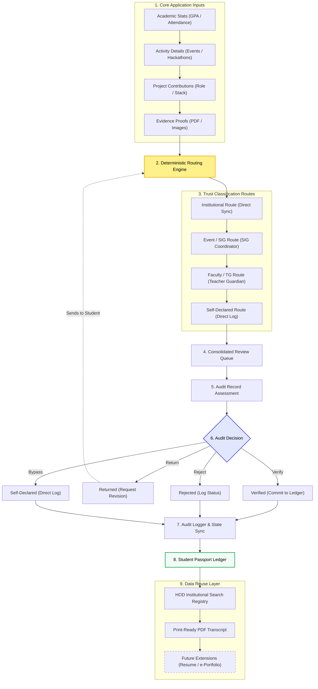

# Implementation Flow — Student Development Passport (Vertical PPT Layout)

This vertical flowchart is optimized to fit cleanly into presentation slides or document columns.

---

## 📊 Vertical Flowchart

